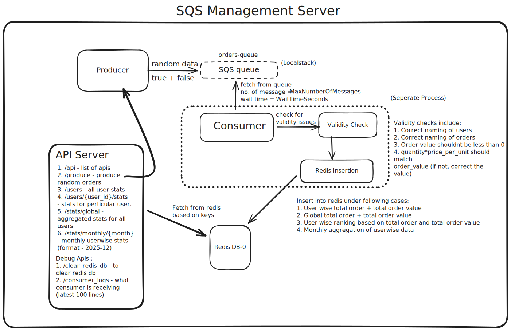

# SQS FastAPI Service

A microservice application that simulates an order processing system using AWS SQS (via LocalStack), Redis for analytics storage, and FastAPI for REST API endpoints. The system processes orders from an SQS queue, validates them, and stores aggregated statistics in Redis.

**The swagger documentation for all apis is present in <host_ip>:9000/docs**

## Features

- **Order Production**: Generate and send random orders to SQS queue
- **Order Consumption**: Background consumer process that polls SQS and processes orders
- **Data Validation**: Validates order data including order ID, user ID, and order value calculations
- **Analytics Storage**: Stores user-wise, global, and monthly statistics in Redis
- **REST API**: FastAPI endpoints for querying statistics and managing the system
- **Logging**: Consumer logs stored in JSONL format for monitoring

## Prerequisites

- Docker and Docker Compose installed
- Git (for cloning the repository)

## Getting Started

### 1. Clone the Repository

```bash
git clone https://github.com/Akshat-Pandey16/sqs-fastapi-service
cd sqs-fastapi-service
```

### 2. Docker Setup (Make sure the following ports are free)

The project uses Docker Compose to orchestrate three services:
- **LocalStack**: Simulates AWS SQS locally
- **Redis**: In-memory data store for analytics
- **SQS Server**: FastAPI application with producer and consumer

#### Start the Services

```bash
docker-compose up -d --build
```

This command will:
- Start LocalStack on port `4566`
- Start Redis on port `6379`
- Build and start the SQS server on port `9000`

#### Check Service Status

```bash
docker-compose ps
```

#### View Logs

```bash
docker-compose logs -f sqs-server
```

#### Stop the Services

```bash
docker-compose down
```


## System Architecture & Flow



### Components

1. **Producer** (`producer.py`)
   - Generates random order data
   - Sends orders to SQS queue via boto3
   - 20% of generated orders are intentionally invalid for testing

2. **Consumer** (`consumer.py`)
   - Runs as a background process
   - Continuously polls SQS queue for messages
   - Validates order data
   - Stores analytics in Redis
   - Handles failed orders

3. **FastAPI Server** (`main.py`, `api.py`)
   - REST API endpoints for system interaction
   - Manages consumer process lifecycle
   - Provides statistics and analytics queries

4. **Redis Storage**
   - User-wise statistics (order count, total spend, failed orders)
   - Global statistics (total orders, revenue, failed orders)
   - Monthly aggregations per user
   - User rankings (by spend and order count)

### Detailed Flow

1. **Order Production**
   - Client sends POST request to `/produce` with order count
   - Producer generates random orders (valid and invalid)
   - Orders are sent to SQS queue via LocalStack

2. **Order Consumption**
   - Consumer process continuously polls SQS queue
   - Receives messages in batches (configurable)
   - Validates each order:
     - Order ID must start with "ORD"
     - User ID must start with "U"
     - Order value must be > 0
     - Calculated order value must match provided value
   - If validation fails, order is marked as failed

3. **Data Storage**
   - Valid orders update:
     - User statistics (order count, total spend)
     - Global statistics (total orders, revenue)
     - Monthly aggregations (per user per month)
     - User rankings (sorted sets for spend and order count)
   - Failed orders are tracked separately

4. **Data Retrieval**
   - FastAPI endpoints query Redis for:
     - User rankings
     - Individual user stats
     - Global statistics
     - Monthly statistics

## API Endpoints

### Base URL
```
http://localhost:9000
```

### Endpoints

#### `GET /api`
Get API information and available endpoints.

#### `POST /produce`
Send random orders to the SQS queue.

**Request Body:**
```json
{
  "count": 10
}
```

**Response:**
```json
{
  "message": "Successfully sent 10 orders to queue",
  "orders": [...]
}
```

#### `GET /consumer_logs`
Get the latest 100 consumer logs.

**Response:**
```json
{
  "total_logs": 100,
  "logs": [...]
}
```

#### `DELETE /clear_redis_db`
Clear all data from Redis database.

**Response:**
```json
{
  "message": "Redis database cleared"
}
```

#### `GET /users?limit=10`
Get user rankings by total spend and order count.

**Query Parameters:**
- `limit` (optional): Number of top users to return (default: 10)

**Response:**
```json
{
  "total_spend_ranking": [...],
  "total_order_count_ranking": [...]
}
```

#### `GET /users/{user_id}/stats`
Get statistics for a specific user.

**Response:**
```json
{
  "user_id": "U1001",
  "order_count": 25,
  "total_spend": 1250.50,
  "failed_order_count": 2
}
```

#### `GET /stats/global`
Get global statistics across all orders.

**Response:**
```json
{
  "total_orders": 150,
  "total_revenue": 75000.00,
  "failed_orders": 5
}
```

#### `GET /stats/monthly/{month}`
Get monthly statistics for a specific month.

**Path Parameter:**
- `month`: Format `YYYY-MM` (e.g., `2025-12`)

**Response:**
```json
{
  "month": "2025-12",
  "total_orders": 50,
  "total_revenue": 25000.00,
  "failed_orders": 2,
  "user_stats": [...]
}
```

## Configuration

Configuration is managed through environment variables in `docker-compose.yml`:

- **AWS Settings**: Region, endpoint URL, credentials
- **SQS Settings**: Queue name, message batch size, wait time, visibility timeout
- **Redis Settings**: Host, port, database number
- **FastAPI Settings**: Server port

## Project Structure

```
sqs-fastapi-service/
├── docker-compose.yml          # Docker Compose configuration
├── requirements.txt            # Python dependencies
├── README.md                   # This file
└── sqs-server/
    ├── Dockerfile              # Docker image definition
    ├── main.py                 # FastAPI application entry point
    ├── api.py                  # API route handlers
    ├── producer.py             # SQS message producer
    ├── consumer.py             # SQS message consumer
    ├── config.py               # Configuration management
    ├── schema.py               # Pydantic models
    ├── logger.py               # Logging utilities
    └── consumer_logs.jsonl     # Consumer log file
```

## Development

### Running Locally (Without Docker)

1. Install dependencies:
```bash
pip install -r requirements.txt
```

2. Start LocalStack and Redis using Docker Compose:
```bash
docker-compose up -d localstack redis
```

3. Set environment variables or create a `.env` file

4. Run the FastAPI server:
```bash
cd sqs-server
python main.py
```

## Testing the System

1. Start the services:
```bash
docker-compose up -d
```

2. Wait for services to be ready (about 10-15 seconds)

3. Send some orders:
```bash
curl -X POST http://localhost:9000/produce \
  -H "Content-Type: application/json" \
  -d '{"count": 20}'
```

4. Check consumer logs:
```bash
curl http://localhost:9000/consumer_logs
```

5. View user rankings:
```bash
curl http://localhost:9000/users?limit=5
```

6. Check global stats:
```bash
curl http://localhost:9000/stats/global
```

7. Check userwise stats:
```bash
curl http://localhost:9000/users/<user_id>/stats
```

8. Check monthly stats:
```bash
curl http://localhost:9000/stats/monthly/<month>
```

## Design Decisions & Architecture Rationale

### Why These Approaches Were Chosen

#### 1. **Background Consumer Process**
- **Non-blocking**: FastAPI API remains responsive while orders are processed asynchronously
- **Separation of Concerns**: API layer handles requests while consumer handles message processing
- **Fault Isolation**: Consumer failures don't crash the API server
- **Resource Management**: Consumer runs in separate process, allowing independent resource allocation

#### 4. **In-Process Consumer vs Separate Service**
- **Current Approach**: Consumer runs as a multiprocessing Process within the FastAPI application
  - **Pros**: Simple deployment, shared configuration, easier development
  - **Cons**: Coupled lifecycle, single point of failure, limited horizontal scaling
- **Why This Works**: Suitable for moderate workloads and simplifies initial development

#### 5. **Validation Before Storage**
- **Data Integrity**: Ensures only valid orders affect analytics and rankings
- **Error Tracking**: Failed orders are tracked separately, enabling monitoring of data quality issues
- **Cost Efficiency**: Prevents invalid data from consuming storage and processing resources

#### 6. **Multiple Redis Data Structures**
- **Hashes for User Stats**: Efficient key-value storage for user-specific metrics
- **Sorted Sets for Rankings**: Automatic ordering and efficient top-N queries
- **Sets for Month Tracking**: Fast membership checks for available months
- **Separate Keys for Different Aggregations**: Enables independent querying and caching strategies

## Scalability Considerations

### Current System Limitations

1. **Single Consumer Process**: Only one consumer processes messages, limiting throughput
2. **Single Redis Instance**: No replication or sharding, potential bottleneck at high loads
3. **In-Process Consumer**: Consumer lifecycle tied to API server, limits independent scaling
4. **LocalStack**: Development tool, not suitable for production workloads

### Scaling Strategies

#### 1. **Horizontal Scaling - API Layer**
```
Load Balancer
    ├── FastAPI Instance 1 (Port 9000)
    ├── FastAPI Instance 2 (Port 9001)
    └── FastAPI Instance 3 (Port 9002)
```
- **Approach**: Deploy multiple FastAPI instances behind a load balancer
- **Benefit**: Distributes API request load across multiple servers
- **Consideration**: Redis remains shared, ensuring consistent analytics across instances

#### 2. **Horizontal Scaling - Consumer Layer**
```
SQS Queue
    ├── Consumer Service 1 (Processes messages)
    ├── Consumer Service 2 (Processes messages)
    └── Consumer Service 3 (Processes messages)
```
- **Approach**: Deploy multiple independent consumer services
- **Benefit**: Parallel message processing increases throughput
- **SQS Feature**: Multiple consumers can poll the same queue; SQS ensures message distribution


#### 5. **Message Processing Optimization**
- **Batch Processing**: Increase `SQS_MAX_NUMBER_OF_MESSAGES` for higher throughput
- **Parallel Processing**: Use thread pool or async processing within consumer for batch items


## Future Enhancements

### 1. **Separate Consumer Service**
**Current State**: Consumer runs as a process within FastAPI application

**Enhancement**: Deploy consumer as independent microservice

### 2. **Message Processing Enhancements**
- **Async Processing**: Use asyncio for concurrent message processing within batches
- **Priority Queues**: Separate queues for high-priority orders
- **Retry Logic**: Exponential backoff for transient failures
- **Circuit Breaker**: Prevent cascading failures when Redis is unavailable
- **Rate Limiting**: Control processing rate to prevent overwhelming downstream systems
- **Batch Processing**: Batch messages till `SQS_WAIT_TIME_SECONDS`, then process in batch using threadpool for concurrent processing.
